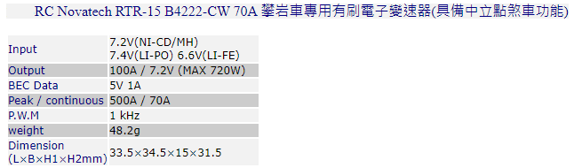

# control_toy_car_over_bluetooth
Making a toy car by arduino+bluetooth  
建立一台由可用藍芽操作的玩具車,玩具車使用2個馬達  
使用arduino + HC05

建議使用  
PC(Linux) + USB2UART(FT232) + HC05(BT host) 控制 
HC05(BT device) + arduino  
而不要  
PC(Linux) + PC的藍芽 控制  
HC05(BT device) + arduino  

使用USB2UART + HC05(BT host), PC端只要考慮/dev/ttyUSB0,省事  
如何配對HC05(BT host)與HC05(BT device)  
自行google一下  
key word for ubuntu  
picocom /dev/ttyUSB0 -b 38400 --omap crcrlf --echo  
AT+ROLE=1  
AT+BIND=98da,20,xxxxxx  

本案使用電子變速器控制馬達轉速與正反轉    
電子變速器的控制,類似於舵機(Servo)的控制  
以筆者的電子變速器, 值0x64馬達不轉, 大於0x64馬達正轉, 小於0x64馬達逆轉  

# 通訊協定
5個byte為一組.  
0x01 0x## 0x02 0x## 0x03  
0x01保留字,下一個byte放入右側舵機參數緩衝區,值為4-255  
0x02保留字,下一個byte放入左側舵機參數緩衝區,值為4-255  
0x03保留字,把左右側舵機參數緩衝區的資料寫到舵機訊號產生器,讓左右動作有最少的時間差

# 架設
PC(Linux) --- USB2UART(FT232) --- HC05(BT host) --- HC05(BT device) --- arduino  --- 電子變速器2x --- 馬達x2  
電子變速器有5V可以給arduino UNO  
使用arduino UNO pin#9及pin#10控制電子變速器  
HC05接5v, GND, 以及TX接到arduino UNO pin#0  
 
 
 
# 測試  
把code燒到arduino  
測試時可以省略HC05  
PC(Linux) --- USB2UART(FT232) --- auduino --- 電子變速器2x --- 馬達x2  

PC(Linux)不用寫code, 用echo就可以測試了  
設定UART
stty -F /dev/ttyUSB0 ispeed 9600 cs8 -parenb -cstopb  

馬達低速正轉  
echo -ne "\x1\x6e\x2\x6e\x3" > /dev/ttyUSB0  

馬達停止  
echo -ne "\x1\x64\x2\x64\x3" > /dev/ttyUSB0  
# 注意事項
電子變速器選用注意事項:  
### BEC電壓準位:  
因為Arduino是5V電壓準位,所以,  
電子變速器的BEC電源,目標是5V的.有些電子變速器BEC輸出6V,直接供電給arduino,可能會燒掉arduino.  
若Arduino吃5V電,PWM控制6V的電子變速器,可能也會發生不穩的問題.  
例如:  
 
### 馬達類別: 
有分有刷/無刷兩種,有刷二條線,無刷三條線.  
### 應用的模型類別: 
有分車用/飛機用,車用的電子變速器可以倒車.  
### 可使用的電池: 
有的只支援2S電池7v4.有的有支援3S的電池.  
