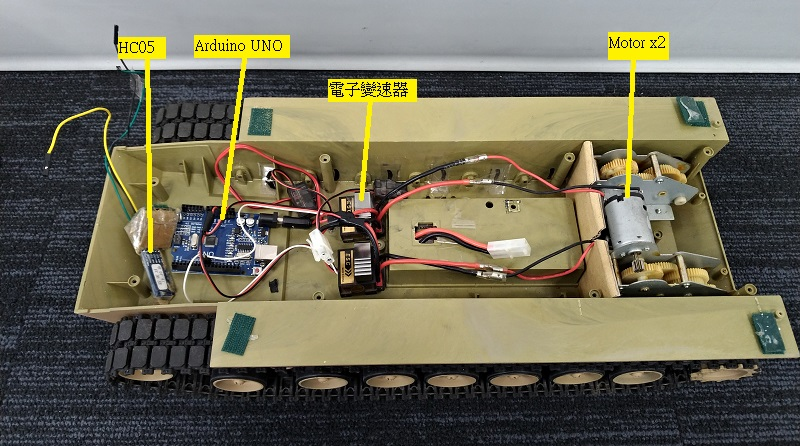

# control_toy_car_over_bluetooth
Making a toy car by arduino+bluetooth  
建立一台由可用藍芽操作的玩具車,玩具車使用2個馬達  
使用arduino + HC05

建議使用  
PC(Linux) + USB2UART(FT232) + HC05(BT host) 控制 HC05(BT device) + arduino  
而不要  
PC(Linux) + PC的藍芽 控制 HC05(BT device) + arduino  

USB2UART + HC05(BT host), PC端只要考慮/dev/ttyUSB0,省事  
如何配對HC05(BT host)與HC05(BT device)  
自行google一下  

本案使用電子變速器控制馬達轉速與正反轉    
電子變速器的控制,類似於舵機的PWM控制  
以筆者的電子變速器, 值0x64馬達不轉, 大於0x64馬達正轉, 小於0x64馬達逆轉  

# 通訊協定
5個byte為一組.  
0x01 0x## 0x02 0x## 0x03  
0x01保留字,下一個byte放入右側PWM參數緩衝區,值為4-255  
0x02保留字,下一個byte放入左側PWM參數緩衝區,值為4-255  
0x03保留字,把左右側PWM參數緩衝區的資料寫到PWM產生器,保証左右動作會一致.  

# 架設
PC(Linux) --- USB2UART(FT232) --- HC05(BT host) --- HC05(BT device) --- arduino  --- 電子變速器2x --- 馬達x2  
使用arduino UNO pin#9及pin#10的PWM  
 
 
 
# 測試  
把code燒到arduino  
測試時可以省略HC05  
PC(Linux) --- USB2UART(FT232) --- auduino --- 電子變速器2x --- 馬達x2  

PC(Linux)不用寫code, 用echo就可以測試了  
設定UART
stty -F /dev/ttyUSB0 ispeed 9600 cs8 -parenb -cstopb  

馬達低速正轉  
echo -ne "\x1\x6e\x2\x6e\x3" > /dev/ttyUSB0  

馬達停止
echo -ne "\x1\x64\x2\x64\x3" > /dev/ttyUSB0  

# In progress  
